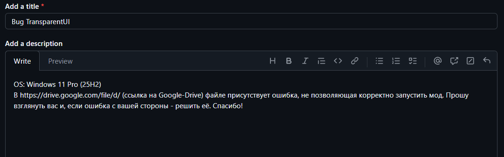

<table align="center">
<tr>
<td>

</td>
    
<td>

</td>
</tr>
</table>
Любые ошибки, пожелания и т.п. следует писать в issue.
Формат заполнения следующий:

Название: Ошибка/Добавление/Помощь имя_мода 
Описание (Ошибка/Помощь): 
Название мода: 
ОС (Windows 10/11); Linux (Дистрибутив); Другая ОС (Укажите) 
Ваш текст: Подробно опишите ошибку и приложите файл client.log (файл или фрагмент текста, где видна ошибка). Если ошибку можно воспроизвести, пожалуйста, перечислите предпринятые вами шаги. Разработчик также может запросить полный список модов, используемых игроком.

